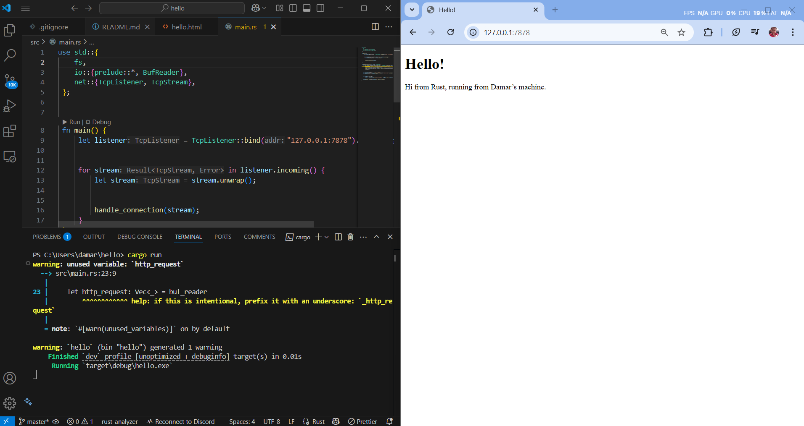
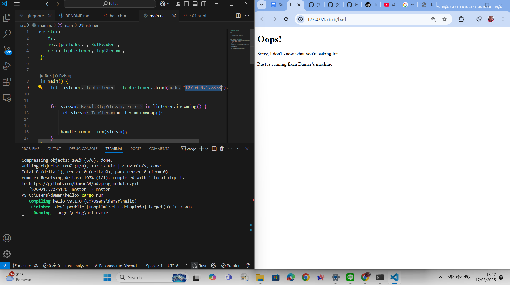

# module 6
 
## Commit 1 Reflection notes
To handle incoming HTTP requests from a web browser, I wrapped the TCP stream with a BufReader, allowing me to read the stream line by line using .lines(). Each line represents a different component of the HTTP request, such as the method, path, or headers.

To simplify processing, I transformed the iterator from Result<String> into String using .map(|line| line.unwrap()). Then, I applied .take_while(|line| !line.is_empty()) to stop reading at the first empty line, which signifies the boundary between the headers and the request body in an HTTP request.

By collecting these lines into a Vec<String>, I was able to obtain a structured, line-by-line view of how a browser communicates with the server. This approach gave me a deeper understanding of the low-level structure of HTTP requests.

## Commit 2 Reflection Notes
 

 
I learned how to serve an actual HTML file instead of just plain text by modifying the handle_connection method. Using fs::read_to_string(), I could easily load the contents of hello.html into memory. By including the appropriate headers along with the file’s content in the HTTP response, I ensured that browsers rendered the page correctly.

Additionally, I discovered the significance of the Content-Length header—omitting it can lead to rendering issues in some browsers. I also gained a deeper understanding of the required structure of an HTTP response, which must follow a specific format: starting with a status line (e.g., HTTP/1.1 200 OK), followed by headers, a blank line, and then the response body.

## Commit 3 Reflection Notes

I modified the handle_connection method to return different responses based on the requested path. By analyzing the request line from the browser, the server determines which page to serve: if the request is for /, it responds with a 200 OK status and serves hello.html; for any other path (such as /bad), it returns a 404 NOT FOUND status along with a custom 404.html file.

This implementation treats / as the only valid request path. If the request line matches GET / HTTP/1.1, the server delivers hello.html with a success status; otherwise, it responds with an error status and displays an error page.

Moreover, the tutorial recommends refactoring the code to enhance clarity and maintainability. By organizing the logic into smaller, reusable components instead of a single function, the code becomes more readable and scalable for future improvements.

## Commit 4 Reflection Notes

I created a /sleep route in the web server to simulate a performance bottleneck. When this route is accessed, the server delays its response by 10 seconds using thread::sleep(). This experiment demonstrated how a single-threaded server struggles under delays or heavy processing loads—if /sleep is accessed in one browser tab, other requests, even to the standard / route in another tab, are blocked until the delay ends.

Through this, I realized that single-threaded architectures do not scale well. In real-world web servers, multithreading or asynchronous processing is crucial to ensure that slow or resource-intensive requests do not block others. This experiment provided valuable insight into the relationship between concurrency and performance in web server design.

## Commit 5 Reflection Notes

In this part of the project, we enhanced our server's performance by implementing a ThreadPool to handle multiple connections concurrently. Instead of spawning a new thread for each request, we initialized a fixed number of threads—four in this case—using ThreadPool::new(4). These threads remain active and are efficiently reused to process incoming tasks.

Within the main loop, we assigned tasks (closures) to the thread pool using pool.execute(). This works similarly to Rust’s thread::spawn(), where a closure is executed, but instead of constantly creating new threads, we reuse existing worker threads, reducing the overhead of thread creation.

For the thread count parameter in ThreadPool::new(), we used the usize type since it represents non-negative integers, making it ideal for defining the number of worker threads, which cannot be negative. Additionally, storing worker threads in a vector aligns well with usize.

In the execute method, we specified the closure type as FnOnce(), indicating that each task runs exactly once. The empty parentheses after FnOnce signify that the closure takes no arguments and returns nothing, similar to a standard function without parameters.